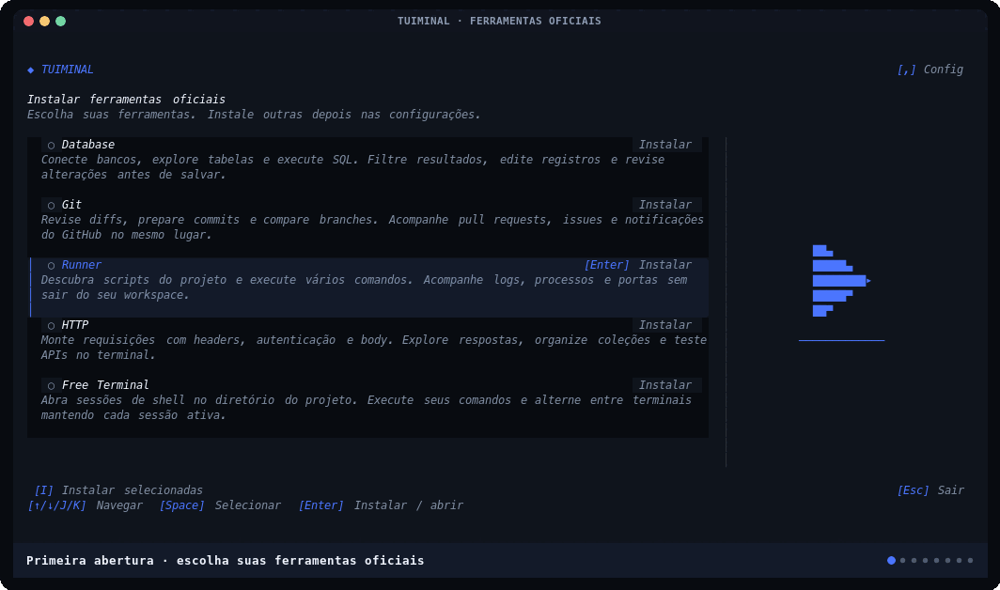

<div align="center">

# Tuiminal

[English](./README.md) · **Português (Brasil)**

### Um workspace completo de desenvolvimento dentro do terminal.

Banco de dados, GitHub, processos, APIs e terminais reais em uma única interface rápida e responsiva.

[](https://www.npmjs.com/package/tuiminal)
[](https://github.com/DeividXupon/tuiminal/releases)
[](./LICENSE)
[](#instalação)

[Instalação](#instalação) · [Banco](#banco) · [Git](#git) · [Runner](#runner) · [HTTP](#http) · [Free Terminal](#free-terminal) · [Contribuir](#desenvolvimento)

</div>

> [!WARNING]
> O Tuiminal está em **alfa**. Já pode ser instalado e testado, mas atalhos, formatos e APIs ainda podem mudar entre versões.

O Tuiminal foi feito para manter o fluxo de trabalho no mesmo lugar. Em vez de alternar entre um cliente de banco, uma interface Git, vários terminais e um cliente HTTP, você abre o projeto uma vez e troca de ferramenta com `[Alt+1–5]`.

- Interface densa construída com Bun, OpenTUI, React e tuiparts.
- Funciona em qualquer diretório; Git, Runner e terminais usam o projeto informado ao CLI.
- Teclado e mouse são cidadãos de primeira classe.
- Layout moldurado ou compacto, sete paletas e seis idiomas.
- Processos e PTYs permanecem vivos enquanto você troca de tab.
- Dados sensíveis, escritas e operações remotas recebem proteções explícitas.

## Instalação

Instale a alfa pelo npm:

```bash
npm install --global tuiminal@alpha
tuiminal
```

Você **não precisa instalar o Bun** para usar o pacote publicado. O npm baixa o binário compatível com macOS, Linux glibc ou Windows, nas arquiteturas x64 e ARM64. Node.js 22 ou superior é usado pelo pequeno launcher do pacote.

Uma instalação nova abre **Instalar ferramentas oficiais**. Escolha Database, Git,
Runner, HTTP ou Free Terminal com `[↑/↓]` / `[J/K]` ou o mouse; pressione `[Enter]`
para instalar e novamente para abrir. Use `[Space]` e `[I]` para instalar várias.
Reabra a tela em `[,]` → **Ferramentas oficiais → Gerenciar ferramentas** ou com
`tuiminal features`. Só as ferramentas instaladas aparecem nas abas; Runner é o
padrão quando disponível. Os downloads têm versão e integridade verificadas e ficam
na pasta de dados do Tuiminal, fora dos seus projetos.

Ferramentas instaladas têm o botão **[D] Desinstalar**. Confirme com `[Y]` ou cancele
com `[Esc]`. A desinstalação encerra as sessões da ferramenta e descarta trabalho
não salvo, preservando projetos e configurações salvas. Você pode instalá-la novamente na mesma tela.

Para automatizar: `tuiminal features install git runner` ou `tuiminal features install all`.

Cada ferramenta tem uma descrição detalhada. Passe o mouse sobre uma linha ou
navegue com `[↑/↓/J/K]` para ver um ícone animado da ferramenta. Database preenche
um cilindro com dados; Runner inicia, avança e conclui uma execução; HTTP envia
uma requisição e recebe a resposta entre cliente e servidor. Git mostra uma
ramificação e Free Terminal exibe uma janela com cursor piscando. Os ícones se
adaptam a terminais menores. Durante o download, o fundo da linha se preenche
da esquerda para a direita conforme o progresso real.




Para atualizar ou remover:

```bash
npm install --global tuiminal@alpha
npm uninstall --global tuiminal
```

## Primeiros passos

Abra o diretório atual, outro projeto ou somente uma ferramenta:

```bash
tuiminal
tuiminal ../meu-projeto

tuiminal banco ./meu-projeto
tuiminal git ./meu-projeto
tuiminal runner ./meu-projeto
tuiminal http ./meu-projeto
tuiminal terminal ./meu-projeto
```

Os aliases `database`/`db`, `run` e `term`/`tty` também são aceitos. No modo isolado, ferramentas ocultas não são inicializadas.

Somente esses comandos e aliases são tratados como ferramentas; outros nomes são caminhos de diretório.

`tuiminal --version` mostra a versão sem carregar configurações ou a interface. `tuiminal --help` mostra a ajuda no idioma configurado.

### Navegação global

| Ação | Atalho |
| --- | --- |
| Abrir Banco | `[Alt+1]` |
| Abrir Git | `[Alt+2]` |
| Abrir Runner | `[Alt+3]` |
| Abrir HTTP | `[Alt+4]` |
| Abrir Free Terminal | `[Alt+5]` |
| Abrir configurações | `[,]` |
| Sair | `[Q]`, `[Esc]` ou `[Ctrl+C]` |

No macOS, `Alt` corresponde a `Option`. Se o terminal não enviar essas combinações, ative **Use Option as Meta key** ou a opção equivalente. Os números sem modificador continuam livres para ações locais das ferramentas.

As ferramentas compartilham notificações flutuantes: no máximo três ficam retidas, sem tirar o foco do teclado. Mensagens temporárias expiram automaticamente; erros permanecem até você fechá-los. Eventos substituídos ou removidos também liberam seus timers, inclusive em rajadas de notificações.

## Cinco ferramentas, um único fluxo

| Tab | Para quê serve |
| --- | --- |
| `[Alt+1]` Banco | Explorar dados e schema, escrever SQL e preparar alterações transacionais. |
| `[Alt+2]` Git | Revisar diffs locais, PRs, Issues e notificações do GitHub. |
| `[Alt+3]` Runner | Detectar comandos, executar serviços e acompanhar vários logs. |
| `[Alt+4]` HTTP | Criar, salvar, executar e automatizar requisições de API. |
| `[Alt+5]` Free Terminal | Abrir shells e qualquer CLI em seções com splits `2 × 2`. |

<a id="banco"></a>

## Banco

<p align="center">
  
</p>

Um explorador de banco responsivo com catálogo, grade, inspetor e workspace SQL. Nenhuma conexão é criada automaticamente: a primeira abertura leva ao gerenciador de conexões.

### O que você pode fazer

- **Conectar:** MySQL/MariaDB, PostgreSQL, SQLite e servidores MySQL MCP opcionais. MCP é sempre explícito e somente leitura.
- **Explorar:** navegar por schemas, tabelas e views; inspecionar registros, colunas, índices, DDL, constraints e relacionamentos.
- **Encontrar dados:** ordenar a coluna ativa, buscar em todas as colunas, paginar e navegar horizontalmente sem perder a linha selecionada.
- **Selecionar em lote:** `[Space]` marca linhas; `[Alt+Space]` fixa uma âncora e `[↑/↓]` aumenta ou reduz um intervalo como em uma planilha.
- **Editar com segurança:** `INSERT`, `UPDATE` e `DELETE` ficam preparados localmente. `[Ctrl+S]` abre uma revisão e executa o conjunto aprovado em uma única transação.
- **Editar grandes seleções:** preparação em lote com busca indexada das alterações existentes, preservando snapshots e chaves `BigInt` exatas antes da revisão.
- **Preservar decimais:** valores de `DECIMAL`, `NUMERIC` e `MONEY` mantêm os dígitos digitados até o envio ao banco, inclusive em notação científica. A precisão e a escala definidas no banco continuam valendo.
- **Escrever SQL:** manter até seis abas independentes, executar somente o comando sob o cursor, cancelar consultas e ajustar a divisão editor/resultado. Trocar o layout ou maximizar o resultado preserva o editor e seu rascunho.
- **Inspecionar e exportar:** visualizar todos os campos da linha e exportar as linhas marcadas em CSV, TSV ou JSON.
- **Proteger informações:** mascarar colunas sensíveis sob demanda e personalizar os termos usados para reconhecê-las.

### Fluxo de escrita

1. Abra uma tabela ou execute um `SELECT` simples editável.
2. Use `[Enter]`/`[E]` para editar, `[Ctrl+A]` para preparar uma linha ou `[dd]` para preparar exclusão.
3. Confira os indicadores de alterações locais na grade.
4. Pressione `[Ctrl+S]`, revise cada comando e confirme novamente.
5. O Tuiminal executa tudo em uma transação; se um comando falhar, o lote inteiro é revertido.

Confirmações rápidas repetidas não duplicam uma execução em andamento. Durante a transação, os comandos aprovados ficam bloqueados para alteração. A paginação acompanha a altura do terminal sem pular registros quando cabem mais de 50 linhas.

Resultados SQL só permitem edição quando selecionam diretamente colunas ou `*` de uma única tabela. Expressões, colunas renomeadas, agrupamentos e `DISTINCT` permanecem somente leitura; editar ou excluir também exige todas as colunas da chave primária no resultado.

No MySQL, campos não qualificados entre aspas duplas ficam somente leitura, pois podem ser textos literais; prefira identificadores entre crases. Colunas entre aspas duplas continuam editáveis no PostgreSQL e SQLite.

Perfis começam em **somente leitura**. Senhas não são gravadas no JSON de configuração: quando solicitado, são enviadas ao Keychain do macOS, libsecret no Linux ou Credential Manager no Windows. `DATABASE_URL`, `MYSQL_URL` e `POSTGRES_URL` podem ser descobertas sem virar perfis editáveis silenciosamente.

O campo de senha mantém a máscara também durante edição e redimensionamento com caracteres largos, como ideogramas e emojis.

Testes de conexão liberam o cliente temporário também quando falham. Nas URLs de ambiente, a senha codificada é decodificada uma única vez e uma URL sem senha não herda a anterior.

A edição de resultados SQL exige colunas diretas, sem renomeações ou duplicações, de uma única tabela identificável; expressões, agregações e consultas ambíguas ficam somente leitura. Alterar/excluir registros exige a chave primária completa no resultado.

Leituras nativas usam transações `READ ONLY` em PostgreSQL, proteção de transação e sessão em MySQL/MariaDB e um arquivo aberto em modo readonly no editor SQLite, inclusive quando o perfil permite escrita. Rotinas não reconhecidas, PRAGMAs de alteração e comandos com efeitos exigem escrita habilitada e confirmação. Use também credenciais com privilégios mínimos no servidor: o modo do aplicativo não é um sandbox para rotinas do banco. No MCP opcional, a restrição de escrita precisa ser aplicada pelo servidor MCP e pelas credenciais dele.

O histórico SQL salva apenas metadados das novas execuções. SQL completo, parâmetros e mensagens de erro detalhadas ficam na sessão, em um cache limitado a 200 entradas e 2 MB. Após encerrar o app ou atingir esse limite, ficam os metadados sem reexecução. Nas configurações do Banco, `[D]` abre a limpeza do conteúdo antigo e `[Y]` confirma: preserva metadados e favoritos, mas não pode ser desfeito e não remove backups. **Favoritos salvos explicitamente continuam gravando o SQL completo em disco**; evite salvar segredos neles.

A prévia de exportação processa só as primeiras linhas visíveis e mantém os valores no idioma original. Copiar ou salvar continua incluindo toda a seleção em CSV, TSV ou JSON.

### Atalhos essenciais do Banco

| Ação | Atalho |
| --- | --- |
| Gerenciar conexões | `[C]` |
| Dados, colunas, índices e schema | `[1]`, `[2]`, `[3]`, `[4]` |
| Navegar por linhas | `[J/K]` ou `[↑/↓]` |
| Abrir tabela ou editar célula | `[Enter]` |
| Buscar tabela / buscar nos dados | `[/]` / `[S]` |
| Ordenar coluna | `[O]` |
| Marcar linha / selecionar intervalo | `[Space]` / `[Alt+Space]` |
| Exportar seleção | `[X]` |
| Página anterior / seguinte | `[P]` / `[N]` |
| Tabela anterior / seguinte | `[A←]` / `[F→]` |
| Abrir workspace SQL | `[W]` |
| Executar comando SQL atual | `[Ctrl+A]` |
| Cancelar consulta | `[Ctrl+X]` |
| Nova aba / fechar aba SQL | `[Ctrl+N]` / `[Ctrl+W]` |
| Alternar abas SQL | `[Alt+←/→]` |
| Ajustar divisão / maximizar painel | `[Ctrl+↑/↓]` / `[F10]` |
| Revisar escritas preparadas | `[Ctrl+S]` |
| Atualizar dados e catálogo | `[R]` |

Configurações de conexões e metadados do histórico ficam em `~/.config/tuiminal/databases.json`, com até 100 leituras recentes e 184 dias de escritas. Novas entradas não persistem SQL, parâmetros ou diagnósticos; termos sensíveis ficam nas configurações globais.

<a id="git"></a>

## Git

<p align="center">
  
</p>

Uma área local no estilo lazygit e três dashboards remotos inspirados no gh-dash. Diffs funciona offline; PR, Issues e Inbox são carregados separadamente somente quando você os abre.

### `[1] Diffs`

- Agrupa arquivos modificados em uma árvore real. Cadeias sem ramificações mostram cada pasta em sua própria linha, sem recuo artificial entre elas, mas `[J/K]` trata toda a cadeia como um único bloco navegável.
- Distingue staged, unstaged e untracked com o status de dois caracteres do Git.
- Exibe preview unificado, lado a lado ou intralinha com syntax highlight e números antigos/novos. A comparação por caractere só é calculada ao usar a visualização intralinha e é reutilizada enquanto o documento não muda.
- Mantém um pequeno grafo de commits sob a árvore; `[G]` expande o grafo e `[O]` abre um histórico no formato do `git log`, com o grafo colorido atravessando todo o bloco do commit. Cada bloco mostra hash, branches/tags, pais de merge, autor e e-mail, data relativa, quantidade de arquivos, estatísticas `+/-`, assunto e corpo da mensagem.
- `[Space]` aplica ou remove stage do arquivo selecionado ou de todos os descendentes da pasta selecionada, inclusive nomes com `*`, `?`, colchetes ou `:`. `[A]` adiciona em cadeia os arquivos da pasta selecionada ou alterna todos quando um arquivo está selecionado; a cor muda imediatamente, novas ações de stage podem ser feitas em sequência e a confirmação consulta somente o status. O preview permanece montado e é reconciliado silenciosamente, sem loader nem reiniciar a rolagem; o grafo é atualizado em segundo plano apenas quando as refs mudam.
- `[Enter]` em um arquivo da árvore abre e foca seu diff. Com um arquivo rastreado e textual em foco, `[S]` abre o stage parcial e força a visualização unificada. “FORA DO STAGE” e “NO STAGE” ficam lado a lado e incluem também os hunks já adicionados ao index, permitindo retirá-los. `[S]` alterna hunk/linha sem perder transferências pendentes nem o syntax highlight, `[H/L/←/→]` atravessa os painéis, `[J/K]` navega e `[Space]` transfere o item; a rolagem mantém o alvo inteiro acima das ações mesmo quando os hunks têm alturas diferentes. Enquanto esse modo está aberto, o terminal Git fica oculto para ceder espaço ao código, `[Tab]` alterna apenas entre os dois painéis e os atalhos não levam à árvore ou ao terminal; `[Enter]` e `[Esc]` aplicam o estado exibido e saem. O hunk ativo recebe uma linha azul em toda a lateral esquerda, e uma alteração do arquivo durante a seleção faz a operação ser recusada com segurança.
- No diff focado, `[Shift+H/L]` ou `[Shift+←/→]` rolam lateralmente até o último caractere, com controles clicáveis no canto inferior direito. Números, sinais e fundos das alterações permanecem fixos; em duas colunas, o código antigo e o novo rolam juntos sem esconder nenhum painel. A navegação vertical preserva a posição horizontal; sair do diff volta à esquerda.
- O cabeçalho de projeto/branch mantém seu espaço ao percorrer a árvore com as setas, sem ser encoberto quando um diff maior termina de carregar.
- `[D]` descarta o arquivo ou toda a pasta selecionada depois de uma confirmação explícita; alterações rastreadas são restauradas e arquivos novos são removidos.
- Um terminal Git sob o diff mantém sete linhas visíveis e até 2.000 linhas de histórico, preservando a saída real dos comandos em vez de resumi-la. `[T]` leva o foco a ele para executar comandos manuais, `[↑/↓]` e o mouse rolam a saída, e `[F10]` maximiza/restaura o terminal dentro do painel de preview; o prefixo `git` é fixo e não há composição de comando por shell. Enquanto você digita, o autocomplete sugere comandos, opções, branches locais/remotas já conhecidas, tags, remotes e arquivos alterados; use `[Ctrl+N/P]` para navegar, `[Ctrl+Y]` para aplicar e `[Esc]` para fechar as sugestões.
- `[C]` alterna para **Comparar**, onde duas refs conhecidas são comparadas por `base...comparada` sem checkout e sem incluir mudanças locais.
- `[Ctrl+P]` escolhe outro repositório e branch local sem alterar o escopo de PR, Issues ou Inbox. No terminal, a tecla pertence ao autocomplete; em modais ou no stage parcial, ela não abre a configuração por cima do contexto atual.
- O tutorial do Git percorre os dois modos locais da aba `[1]` com dados inteiramente simulados. Primeiro ensina Diffs — cabeçalho, árvore de alterações, mini árvore de commits, diff, ações, terminal, navegação, `[Ctrl+P]`, `[Space]`, `[G]`, `[O]`, `[V]`, `[S]` e `[D]`. Depois entra visualmente em `[C] Git · Comparar`, abre a configuração local e os seletores fictícios de branch base e comparada, explica o intervalo `base...comparada`, mostra o resumo somente de commits, a árvore agrupada, o diff selecionado, as três visualizações e a volta por `[C]` ou `[Esc]`. Cada etapa que muda a tela mostra o próprio resultado; o tutorial não procura projetos, não executa Git, não busca refs e não acessa GitHub.

### `[2] PR`

- Começa com **My PRs**, **Review requested**, **All**, **Open** e **Closed**; os três últimos mostram todos os PRs não arquivados, somente os abertos ou somente os fechados dentro do escopo atual.
- Lista estado, repositório, revisão, CI, autor, responsáveis, comentários, labels e tamanho do diff.
- A prévia alterna entre visão geral, checks, atividade, commits e arquivos.
- Parar o acompanhamento de CI ou fechar sua tela cancela a consulta ativa; respostas antigas não notificam nem interrompem um novo acompanhamento.
- Na Atividade, `[J/K]` seleciona comentários, `[E]` abre as cinco reações rápidas (👍 ❤️ 🎉 😄 👀) e `[Enter]` responde com referência ao comentário original; respostas aparecem agrupadas sob o comentário-pai, e um comentário que já possui reação mostra `[E] Nova reação`. `[Shift+E]` reage ao próprio PR.
- O diff remoto abre dentro do Tuiminal e mantém a fila preservada ao voltar.
- Busca e seções usam qualifiers do GitHub com autocomplete para `repo:`, `author:`, `review-requested:` e outros filtros.
- Comentários, review, merge e demais escritas usam preparação, reautenticação, releitura do estado remoto e confirmação antes da execução.

### `[3] Issues`

- Começa com **My Issues**, **All**, **Open** e **Closed**; os três últimos mostram todas as issues não arquivadas, somente as abertas ou somente as fechadas dentro do escopo atual.
- Combina uma lista densa de duas linhas com visão geral e atividade da issue.
- Na Atividade, `[J/K]` seleciona comentários, `[E]` reage com 👍 ❤️ 🎉 😄 ou 👀 e `[Enter]` responde; respostas aparecem agrupadas sob o comentário-pai, e um comentário que já possui reação mostra `[E] Nova reação`. `[Shift+E]` reage à própria issue.
- Permite comentar, atribuir/remover responsáveis, editar labels, criar branch com checkout, fechar e reabrir.
- A busca sempre fica limitada a issues não arquivadas e nunca vira acidentalmente uma pesquisa global do GitHub.

### `[4] Inbox`

- Reúne Inbox, revisões solicitadas, itens atribuídos, menções e itens salvos localmente.
- Marcar como lida é explícito; concluir e cancelar inscrição sempre pedem confirmação.
- A atualização automática preserva os dados visíveis quando a rede falha.

PR e Issues usam o repositório do `origin` quando ele é reconhecido. Fora de um repositório, o escopo padrão é a conta autenticada — organizações e repositórios externos incluídos de forma explícita — em vez de uma busca aberta em todo o GitHub. As áreas remotas exigem o [GitHub CLI](https://cli.github.com/) 2.40.0 ou mais recente. Quando `gh` não está disponível ou precisa ser atualizado, PR, Issues e Inbox explicam sua função, mostram o comando oficial detectado, oferecem `[C]` para copiá-lo e um mini terminal interativo focado com `[Enter]` ou mouse. O Tuiminal abre somente o shell: o usuário cola e executa o comando, e a versão é detectada automaticamente; se o shell encerrar, `[Enter]` abre outro. A falta de autenticação abre o mesmo passo a passo para `gh auth login --hostname <host> --web`; o login e o token permanecem sob responsabilidade do `gh`/GitHub, e a tela recarrega ao detectar a conta.

As chamadas automáticas ao `gh` têm limite de tempo e aguardam o encerramento do
processo ao cancelar. Se uma escrita em PR/Issue ficar sem confirmação — por
timeout, cancelamento, limite de saída ou entrada incompleta — ela não é reenviada
automaticamente. Confira o estado remoto antes de tentar novamente.

Nos detalhes de PRs e Issues, trocar de item libera a paginação imediatamente;
respostas antigas não substituem uma atualização mais recente. Carregar mais
repetidamente no mesmo lote de eventos inicia uma única consulta. Alterações em
comentários de um PR invalidam seus detalhes em cache mesmo sem um commit novo.
Na aba Checks, execuções e erros de outro PR desaparecem assim que a seleção
muda; respostas atrasadas não reaparecem no PR atual. PR, Issues e Inbox reutilizam o
texto das linhas ao navegar, preservando atualizações de idioma, cores e dados.

Nas configurações Git, projetos locais e repositórios remotos aparecem assim que
cada busca termina, sem esperar a outra. Fechar ou recarregar o modal cancela a
consulta remota anterior. O autocomplete de queries processa só os candidatos
necessários para preencher as sugestões visíveis.

Nos seletores de projeto e branch local, pressionar `[Enter]` repetidamente não
repete uma seleção em andamento. Fechar o seletor por `[Esc]`, pelo botão ou fora
do modal impede que sua resposta atrasada feche outro seletor aberto depois.
Fechar não cancela nem desfaz um comando Git que já foi iniciado.

Na busca de PRs e Issues, texto entre aspas permanece literal: mencionar `repo:`
ou `author:@me` dentro de uma frase não remove o filtro da conta. Valores como
`label:"help wanted"` preservam os espaços, e aspas abertas precisam ser fechadas
antes de enviar a consulta. Aplicar ou salvar uma busca incompleta mostra o aviso
no próprio modal, mantendo o texto e o foco para você corrigir.

### Atalhos essenciais do Git

| Ação | Atalho |
| --- | --- |
| Abrir Diffs, PR, Issues ou Inbox | `[1]`, `[2]`, `[3]`, `[4]` |
| Alternar Diffs / Comparar | `[C]` |
| Navegar na lista | `[J/K]` ou `[↑/↓]` |
| Alternar foco entre árvore, preview e terminal Git | `[Tab]`; `[H/L]` ou `[←/→]` entre árvore e preview |
| Rolar lateralmente no diff focado | `[Shift+H/L]` ou `[Shift+←/→]` |
| Mudar seção | `[A←]` / `[F→]` |
| Mudar aba interna do preview | `[Z←]` / `[V→]` |
| Abrir diff remoto | `[D]` |
| Abrir ações remotas | `[?]` |
| Stage do arquivo / pasta ou todos | `[Space]` / `[A]` |
| Stage parcial por hunk ou linha no diff focado | `[S]`; depois `[S]`, `[H/L/←/→]`, `[J/K]`, `[Space]` e `[Enter]` |
| Descartar arquivo/pasta com confirmação | `[D]` |
| Focar terminal Git | `[T]` |
| Abrir histórico / grafo local | `[O]` / `[G]` |
| Mudar visualização do diff | `[V]` |
| Alterar projeto/branch de Diffs | `[Ctrl+P]` |
| Editar query remota | `[/]` |

O escopo remoto é salvo nos perfis de Git. A escolha local de Diffs fica separada em `~/.config/tuiminal/git-diffs.json`; itens salvos do Inbox ficam em `~/.config/tuiminal/git-inbox.json` com permissão `0600`.

<a id="runner"></a>

## Runner

<p align="center">
  
</p>

O Runner é a tela inicial do Tuiminal. Ele detecta comandos do projeto, inicia processos de curta ou longa duração e mantém logs, entrada e histórico dentro do mesmo workspace.

### O que você pode fazer

- **Detectar automaticamente:** scripts JavaScript, Composer/PHP, Laravel, Symfony, Python/Django, Go, Rust, Ruby/Rails, Maven, Gradle, .NET, Deno, Taskfile, Makefile, justfile e Docker Compose.
- **Executar qualquer coisa:** o campo manual aceita o comando literal; `[Ctrl+S]` salva o comando com nome e opção explícita de PTY.
- **Manter processos vivos:** selecionar um comando já ativo abre a sessão existente. `[R]` é a ação separada para iniciar outra instância.
- **Acompanhar logs:** alternar stdout/stderr, filtrar, copiar, exportar, mostrar horários e enviar dados para `stdin` ou PTY.
- **Ver vários serviços:** o modo Multi mostra até três logs lado a lado e navega por grupos adicionais.
- **Agir em grupo:** marcar comandos e iniciar, parar ou reiniciar todos em paralelo; grupos não fingem ser grafos de dependência.
- **Trocar de projeto:** `[N]` abre outro repositório ou diretório sem interromper processos atuais. Até quatro projetos ficam em tabs locais `[1]–[4]`.
- **Usar portas detectadas:** abrir a URL, copiá-la ou enviar a requisição diretamente para a tab HTTP.

Os logs são atualizados em lotes e retêm até 1.200 entradas, com limites de tamanho por entrada e por processo. Limpar o log também descarta a saída pendente de exibição; ao encerrar, as últimas linhas são preservadas na tela.

Single e Multi preservam o idioma original da saída dos programas; somente mensagens do Tuiminal são traduzidas. A detecção de portas aguarda cada sondagem terminar antes de iniciar a seguinte e cancela apenas seu próprio auxiliar ao sair do contexto.

A busca de projetos evita repetir pastas sobrepostas e faz até 16 leituras simultâneas, respeitando o limite de 300 projetos e sete níveis. Os comandos detectados usam os caminhos do projeto selecionado, e arquivos Deno JSONC preservam o texto das tarefas mesmo quando contêm marcadores de comentário.

Arquivos `.tuiminal/runner.yaml`, `mprocs.yaml`, `Procfile`, `Procfile.dev`, `Taskfile`, `Makefile` e outros formatos reconhecidos alimentam a descoberta. Somente `autostart: true` declarado no arquivo do Tuiminal pode solicitar início automático. Na primeira vez, o Runner mostra o projeto, os comandos, diretórios, perfil e nomes das variáveis para aprovação; a confiança é local e uma mudança material na configuração exige nova confirmação. `mprocs` e `Procfile` nunca recebem início implícito.

```yaml
version: 1

profiles:
  development:
    envFile: .env.development
    env:
      LOG_LEVEL: debug

commands:
  api:
    command: npm run dev
    profile: development
    cwd: services/api
    restart: on-failure
    maxRestarts: 5
    health:
      type: http
      url: http://127.0.0.1:3000/health
      timeoutMs: 30000
```

### Atalhos essenciais do Runner

| Ação | Atalho |
| --- | --- |
| Executar ou abrir processo existente | `[Enter]` |
| Iniciar outra instância | `[R]` |
| Focar comando manual / salvar | `[/]` / `[Ctrl+S]` |
| Comandos / processos ativos | `[P]` |
| Visualização única / múltipla | `[M]` |
| Grupo anterior / seguinte no modo múltiplo | `[A←]` / `[F→]` |
| Selecionar grupo | `[Space]` |
| Iniciar / parar / reiniciar grupo | `[G]` / `[Shift+G]` / `[Shift+R]` |
| Lista → log / log → lista | `[L/→]` / `[H/←]` |
| Abrir ou recolher histórico | `[S]` |
| Parar processo atual | `[Shift+K]` |
| Abrir menu de ações | `[A]` (único) / `[Shift+A]` (múltiplo) |
| Abrir outro projeto | `[N]` |
| Alternar projetos do Runner | `[1]`–`[4]` |
| Fechar tab de projeto sem parar processos | `[Ctrl+X]` |

Estado de sessão e comandos salvos ficam em `~/.config/tuiminal/runner.json`. Logs só são persistidos por opt-in ou exportação para `tuiminal-logs/`. Ao sair do Tuiminal, ele encerra somente os processos que iniciou.

<a id="http"></a>

## HTTP

<p align="center">
  
</p>

Um cliente de API compacto com documentos, coleção, builder, resposta e automação. O layout passa de três colunas para split ou painel único conforme o espaço, sem perder drafts, cursor, resposta ou foco.

### O que você pode fazer

- **Montar requests:** método, URL, query params, headers, JSON/texto/XML, form URL encoded, multipart, arquivo e autenticação Bearer, Basic ou API Key.
- **Inspecionar respostas:** status, duração, tamanho, headers, timing, Pretty/Raw, busca, JSONPath, cópia, salvamento e comparação. JSON válido recebe formatação e cores; no response focado, `[↑/↓]` ou `[J/K]` percorrem blocos, `[←/→]` recolhem/expandem e `[Enter]` alterna o bloco atual.
- **Controlar o espaço:** request e response começam em `50/50`; `[Ctrl+↑/↓]` e o drag handle usam a mesma proporção por documento, limitada entre 25% e 70%.
- **Versionar coleções:** abrir e salvar `.http`/`.rest` interoperáveis sem regravar silenciosamente blocos que o Tuiminal não entende.
- **Importar:** Postman v2.1 e OpenAPI 3.0/3.1, com preview das conversões, avisos de perda e proteção para segredos encontrados.
- **Automatizar:** assertions de status/header/body/JSONPath, dependências entre requests e extração de variáveis públicas ou voláteis.
- **Executar coleções:** resolver dependências em ordem topológica, usar dataset JSON/CSV, limitar concorrência e emitir relatórios text, JSON ou JUnit. Selecionar um request funciona também quando há nomes iguais. Reabrir o executor ou mudar seu alvo cancela a execução anterior; resultados atrasados não substituem a nova execução.
- **Trabalhar com ambientes:** variáveis públicas/privadas por diretório, defaults do workspace e referências opacas ao gerenciador de credenciais do sistema. O campo de valor privado mantém a máscara durante edição e redimensionamento, inclusive com ideogramas e emojis.
- **Controlar transporte:** timeout, redirects, cookie jar, proxy HTTP/HTTPS e TLS. O jar valida domínios pela Public Suffix List, impõe limites e fica isolado por ambiente e diretório da coleção; `[C]` pode desativar tanto leitura quanto escrita de cookies por request. Desabilitar verificação TLS é explícito, visível em vermelho e exige aprovação por destino.
- **Revisar redirects sensíveis:** antes de enviar um corpo ou URL com valores privados para outra origem, ou trocar HTTPS por HTTP, o envio pausa para sua autorização. `[Y]` continua somente aquele salto; `[Esc]` recusa. O destino e os riscos aparecem na confirmação, com valores privados conhecidos mascarados. Cancelar não desfaz uma requisição que o servidor anterior já recebeu.
- **Tratar respostas externas com cautela:** `[O]` abre somente imagens raster allowlisted quando MIME e assinatura conferem. SVG, PDF, binários genéricos e conteúdo disfarçado ficam bloqueados no handler do sistema, mas ainda podem ser salvos explicitamente. O download completo reenvia apenas GET, tem teto de 256 MB e remove arquivos parciais em falhas. Acionamentos repetidos não duplicam o download; fechar o documento que o iniciou cancela a operação. O arquivo só é publicado depois da gravação completa, sem substituir um destino existente.

### Atalhos essenciais do HTTP

| Ação | Atalho |
| --- | --- |
| Alternar rota, coleção, requisição e resposta | `[Tab]` / `[Shift+Tab]` ou `[H/L]` |
| Focar URL / enviar / cancelar | `[/]` / `[S]` ou `[Enter]` / `[X]` |
| Método anterior / seguinte | `[Shift+M]` / `[M]` |
| Ciclar Params, headers, body, auth e mais com a requisição focada | `[A←]` / `[F→]` |
| Ciclar opções internas de Body, Auth ou Mais | `[Z←]` / `[V→]` |
| Alternar Query Params / Path Params | `[J/K]` ou `[↑/↓]` |
| Adicionar item ao subpainel focado | `[N]` |
| Navegar / recolher / expandir JSON | `[↑/↓]` ou `[J/K]` / `[←/→]` / `[Enter]` |
| Abrir ambientes | `[E]` |
| Alternar visualização principal / aba interna da resposta | `[A←]` / `[F→]` · `[Z←]` / `[V→]` |
| Abrir coleção / histórico | `[C]` / `[Y]` |
| Nova tab / fechar tab | `[Ctrl+N]` / `[Ctrl+W]` |
| Alternar documentos | `[Alt+←/→]` |
| Salvar `.http` | `[Ctrl+S]` |
| Ajustar split / maximizar | `[Ctrl+↑/↓]` / `[F10]` |
| Abrir jump mode | `[Ctrl+O]` |

Exemplo de request versionável:

```http
### Buscar usuário
# @name buscar-usuario
# @depends login
# @extract-secret token = $.token
# @assert status == 200
# @assert jsonpath $.id exists
GET {{baseUrl}}/users/42
Authorization: Bearer {{token}}
```

O mesmo motor também funciona sem abrir a interface:

```bash
tuiminal http run api.http#buscar-usuario --env local --report text
tuiminal http run api.http --data cases.json --concurrency 4 --report junit
tuiminal http import postman collection.json --output .tuiminal/http/imported
tuiminal http import openapi openapi.yaml --output .tuiminal/http/imported
```

No modo sem interface, redirects que transportam corpo/URL privada exigem
`--allow-private-redirect-to https://destino.example`; downgrade exige
`--allow-http-redirect-to http://destino.example`. As flags aceitam somente uma
origem exata (protocolo, host e porta), podem ser repetidas para outros destinos e
valem apenas para o comando atual. Quando os dois riscos existem, as duas
autorizações são necessárias. `--allow-insecure-tls` é uma autorização separada.
Mesmo com aprovação, headers privados/autenticação da origem não são encaminhados.
A continuação não repete o envio anterior nem as dependências da coleção. Timeout
e cancelamento descartam confirmações pendentes; autorizações atrasadas não enviam
requests. TLS inseguro na interface mantém `[I]`, por destino, ambiente e sessão.

Respostas são capturadas até cerca de 1,5 MB e renderizadas de forma limitada para manter a interface responsiva. A captura libera o leitor ao terminar ou falhar e só marca truncamento quando encontra bytes além do limite. A busca acompanha linhas e colunas sem reprocessar todo o texto anterior a cada ocorrência. Valores identificados como secretos são mascarados em preview, cURL, conflitos, relatórios e erros; variáveis extraídas como secretas ficam somente em memória.

O histórico persistente é opcional e mascara os segredos conhecidos também nas URLs, redirecionamentos e metadados. Mesmo com **Persistir bodies** ativado, execuções com variáveis privadas, autenticação ou cookies conhecidos mantêm o corpo apenas na sessão. A resposta original continua disponível na memória para inspeção e exportação explícita. Outros corpos podem conter dados privados que o Tuiminal não reconhece: o opt-in não os torna seguros para compartilhar. Essa proteção não limpa automaticamente históricos antigos, arquivos exportados nem backups.

Redirects que mudam o host, a porta ou o protocolo removem headers de autenticação e outros headers sensíveis, incluindo API keys com nomes personalizados e valores privados resolvidos. Esses headers são preservados em redirects dentro da mesma origem.

Em Params → Path, use segmentos `:id` ou tokens explícitos `{id}` (por exemplo, `/users/:id` ou `/reports/{id}.json`). A substituição ocorre apenas no caminho, preserva nomes como `id` e `id2` e usa a primeira linha ativa quando o nome se repete. Query, host e porta continuam independentes desses parâmetros.

Valores de Path marcados como sensíveis seguem essa proteção, inclusive em URLs codificadas e linhas desativadas. Para salvar esses parâmetros em `.http`, use referências a variáveis privadas; valores secretos literais são recusados sem alterar o arquivo.

<a id="free-terminal"></a>

## Free Terminal

<p align="center">
  
</p>

Um multiplexador genérico, não um terminal restrito a uma ferramenta. Cada painel usa um PTY real e pode executar shells, REPLs, bancos interativos, Codex, Claude ou qualquer CLI disponível no `PATH`.

Comandos personalizados aceitam expressões completas do shell, incluindo `&&`, `||`, `;`, pipes, variáveis e laços. Por exemplo, `npm install && npm run dev` executa a segunda etapa se a primeira terminar com sucesso.

### O que você pode fazer

- Criar seções independentes e manter até 12 terminais na execução.
- Organizar cada seção em até quatro painéis numa grade `2 × 2`.
- Dividir o painel ativo para o lado ou criar uma linha inferior.
- Alternar entre a seção inteira e um terminal maximizado.
- Ao reiniciar, fechar um painel ou sair do Tuiminal, aguardar a saída observada dos processos próprios; após um período de graça, o encerramento escala para a árvore criada, sem procurar ou matar processos por nome/porta.
- Redimensionar a tela preserva a saída e não executa novamente comandos encerrados. Pedidos repetidos de reinício criam apenas a sessão mais recente; fechar o painel cancela um reinício ainda aguardando o processo anterior.
- Preservar cores, cursor, prompts interativos e aplicações TUI em tela cheia.
- Trocar de tab sem encerrar as sessões.
- Focar, dividir, reiniciar e fechar painéis pelo teclado ou mouse.

O prefixo `[Ctrl+B]`, inspirado no tmux, separa os comandos do multiplexador das teclas enviadas ao processo aberto:

| Depois de `[Ctrl+B]` | Ação |
| --- | --- |
| `[C]` | Criar seção |
| `[V]` | Dividir para o lado |
| `[S]` | Dividir para baixo |
| `[N]` / `[P]` | Próximo terminal / terminal anterior |
| `[1]`–`[4]` | Focar terminal visível |
| `[M]` ou `[F]` | Alternar seção / foco |
| `[[]` / `[]]` | Seção anterior / seguinte |
| `[R]` | Reiniciar sessão |
| `[X]` | Fechar sessão |
| `[G]` | Liberar o terminal para usar os atalhos globais |
| `[Ctrl+B]` | Enviar `Ctrl+B` ao processo aberto |

O campo `CMD` é opcional: vazio abre o shell padrão; preenchido executa o comando informado. Ao fechar o Tuiminal, somente os processos criados por ele são encerrados.

## Interface e personalização

`[,]` abre configurações contextuais. As mudanças são aplicadas sem desmontar editores, perder foco ou apagar o estado das ferramentas.

- **Modo de cor:** Dark ou Light.
- **Paletas:** Prime, Midnight, Nord, Gruvbox, Dracula, Catppuccin e Tokyo Night.
- **Layout:** Moldurado, com gaps e bordas completas; ou Compacto, com mais espaço e uma linha de foco por painel.
- **Idiomas:** português brasileiro, inglês, espanhol, japonês, chinês simplificado e coreano.
- **Tutorial:** um tour da ferramenta ativa com dados simulados e sem acesso a serviços reais.
- **Mouse:** tabs, listas, botões, campos, commits, diffs, scroll e splits continuam clicáveis.
- **Notificações:** informações, sucessos, avisos e erros aparecem sem roubar o foco.

As preferências ficam em `~/.config/tuiminal/settings.json`.

Se o arquivo contiver um nome de paleta inválido, a interface usa Prime e preserva as demais preferências válidas.

A tradução de mensagens com prefixos repetidos de erro ou aviso não corta o texto nem depende da profundidade da pilha de chamadas.

## Desenvolvimento

O pacote npm não exige Bun do usuário final. O checkout de desenvolvimento usa **Bun 1.4.2**, registrado em `.bun-version` e `package.json`:

```bash
git clone https://github.com/DeividXupon/tuiminal.git
cd tuiminal
bun install --frozen-lockfile
bun run dev
```

O desenvolvimento usa o mesmo instalador, com pacotes gerados localmente e cache
separado. Após editar uma ferramenta, reinicie `bun run dev` e instale o novo pacote.
Se gerar os pacotes separadamente com `bun run build:features`, reinicie a aplicação
antes de instalar. Não precisa publicar no npm.
Veja o [contrato de instalação](./docs/design/official-feature-installation.md).

Comandos principais:

| Comando | Finalidade |
| --- | --- |
| `bun run dev` | Gerar pacotes locais e abrir o fluxo de instalação |
| `bun run build:features` | Gerar os cinco pacotes oficiais instaláveis |
| `bun run test:unit` | Testar regras e integrações locais |
| `bun run test:tui` | Testar a interface com o renderer real do OpenTUI |
| `bun run check` | Typecheck, formato, lint, workspaces, arquitetura, manutenção e testes |
| `bun run check:workspaces` | Conferir versões, exports e dependências de cada pacote |
| `bun run build:packages` | Gerar JavaScript, tipos e manifests dos seis módulos internos |
| `bun run test:packages` | Empacotar e instalar os módulos em um projeto temporário |
| `bun run check:licenses` | Conferir o inventário reproduzível de licenças de produção |
| `bun run docs:demos` | Recriar os GIFs do instalador e das cinco ferramentas |
| `bun run build:release` | Gerar os pacotes de distribuição por plataforma |
| `bun run test:release` | Validar hashes, tarballs e a instalação final sem Bun no `PATH` |

`bun run docs:demos` usa dados simulados ou um repositório temporário, nunca credenciais e serviços do usuário. A conversão final dos frames requer [ImageMagick](https://imagemagick.org/).

Antes de contribuir, leia:

- [Guia de contribuição](./CONTRIBUTING.md)
- [Política de segurança](./SECURITY.md)
- [Processo de release](./docs/release-process.md)
- [Arquitetura do projeto](./docs/architecture.md)
- [Decisão do monólito modular](./docs/adr/0001-modular-monolith.md)

## Arquitetura e próximos passos

O inglês é o idioma principal da documentação. Mantenha este arquivo e o
[README em inglês](./README.md) sincronizados quando o conteúdo compartilhado mudar.

O código usa um **monorepo com Bun workspaces**. `apps/cli` compõe a aplicação,
`packages/core` reúne infraestrutura e componentes compartilhados, e
`packages/feature-{git,database,runner,http,terminal}` contém as cinco ferramentas.
Cada pacote tem seu `package.json`; `bun install` conecta as dependências locais
declaradas com `workspace:*`, sem precisar de links manuais.

Os seis módulos gerados por `bun run build:packages` ficam em `dist/packages` e
apontam para suas respectivas pastas neste mesmo repositório. Seus contratos são
internos e suas versões acompanham o CLI. Os manifests de fonte permanecem privados;
o empacotamento prepara os artefatos, sem publicá-los. A distribuição atual pelo npm
usa o launcher `tuiminal` com um binário mínimo por plataforma e cinco ferramentas
oficiais instaladas separadamente.

O [checklist de prontidão para alfa](./ALPHA_READINESS_PLAN.md) resume o hardening
local e os aceites que ainda bloqueiam uma alfa. Ele não representa aprovação de
release nem uma nova versão publicada no npm.

Database, Git, Runner, HTTP e Free Terminal são funcionalidades oficiais mantidas internamente pelo Tuiminal. Não há plano de SDK público, marketplace ou carregamento de plugins comunitários. A instalação mínima baixa componentes oficiais compatíveis sob demanda, sempre gerenciados pelo próprio Tuiminal e sem modificar o projeto aberto pelo usuário.

O [plano do cliente HTTP](./HTTP_CLIENT_PLAN.md) registra os próximos passos dessa ferramenta.

As especificações mantidas da interface Git e de seus contratos estão em:

- [Git Diffs e Pull Requests](./docs/design/git-pr-interface.md)
- [Git Issues](./docs/design/git-issues-interface.md)
- [Git Inbox](./docs/design/git-inbox-interface.md)

## Licença

Copyright 2026 DeividXupon.

Distribuído sob a [Apache License 2.0](./LICENSE). Você pode usar, modificar e distribuir o Tuiminal, inclusive comercialmente, desde que preserve os termos e avisos exigidos pela licença. Os avisos dos componentes incorporados estão em [THIRD_PARTY_NOTICES.md](./THIRD_PARTY_NOTICES.md).
